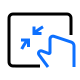
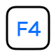

  
  <h1>LaunchOS</h1>

  

    
    
  

  <h3 align="center">LaunchOS - Best Launchpad Alternative for macOS 26 (Tahoe)</h3>

  

    
  

English | [简体中文](./README_CN.md)

[LaunchOS](https://launchosapp.com) is a reimagined Launchpad built to feel instantly familiar, effortlessly smooth, and surprisingly powerful. Lightweight and refined, it mirrors the native experience with remarkable accuracy — from its look to its fluid interactions.

We rebuilt the small details that truly shape your daily flow, and added a few smart upgrades Apple never did, making it the most natural and capable Launchpad experience on macOS 26.

<h2 align="center">LaunchOS Features</h2>

Refined and Perfected

<table>
  <tr>
    <td align="center" width="25%">
       
      <strong>Native Launchpad Experience</strong>
    </td>
    <td align="center" width="25%">
       
      <strong>Seamless with Liquid Glass</strong>
    </td>
    <td align="center" width="25%">
       
      <strong>Built Natively, Smooth and Fast</strong>
    </td>
    <td align="center" width="25%">
       
      <strong>Quick Right-Click Menu</strong>
    </td>
  </tr>
  <tr>
    <td align="center">
       
      <strong>Launch with Trackpad Gesture</strong> 
      <code>PRO</code>
    </td>
    <td align="center">
       
      <strong>Launch with Global HotKey</strong>
    </td>
    <td align="center">
       
      <strong>Launch from Hot Corners</strong> 
      <code>PRO</code>
    </td>
    <td align="center">
       
      <strong>Launch with Keyboard F4 Key</strong> 
      <code>PRO</code>
    </td>
  </tr>
  <tr>
    <td align="center">
       
      <strong>Customizable Grid Layout</strong> 
      <code>PRO</code>
    </td>
    <td align="center">
       
      <strong>Vertical Scroll View</strong> 
      <code>PRO</code>
    </td>
    <td align="center">
       
      <strong>Custom App Renaming</strong> 
      <code>PRO</code>
    </td>
    <td align="center">
       
      <strong>Hide Unwanted Apps</strong> 
      <code>PRO</code>
    </td>
  </tr>
  <tr>
    <td align="center">
       
      <strong>Window Browsing Mode</strong> 
      <code>PRO</code> <code>COMING SOON</code>
    </td>
    <td align="center">
       
      <strong>Completely Uninstall Apps</strong> 
      <code>PRO</code> <code>COMING SOON</code>
    </td>
    <td align="center">
       
      <strong>Rapid Iteration Ahead</strong> 
      <code>BASED ON YOUR FEEDBACK</code>
    </td>
    <td align="center"></td>
  </tr>
</table>

## FAQ

**Is the product free?**

LaunchOS offers a free basic version, as well as a paid Pro version with a 7-day free trial.
For many users, the features of the free version are sufficient.

**What should I do if I haven't received the license email?**

After payment, you will receive two emails: a receipt and a license email. The license email may arrive a few minutes later than the receipt.
If you only received the receipt, please check your spam folder, as the license email may have been incorrectly marked as spam by your email provider.
If you received neither email, it usually means an incorrect email address was entered during checkout, or your email service cannot receive emails normally.
No matter the situation, don’t worry—contact us via the email below to resolve the issue.

**What should I do if the app says my license is invalid?**

Please ensure you haven’t copied any extra characters, such as spaces or line breaks, when copying the license.
Try pasting the code into a plain text editor first, then copy it again into the app.
If the issue persists, please contact us via the email below.

**Do I need to repurchase the license when changing devices?**

You do not need to repurchase. If you change your device, simply remove the old device during the activation process. You can also manage your devices in the Settings > About > Device Management interface.

**Do I need to repurchase the license when upgrading to a new major version?**

No, you do not need to repurchase. All purchases include lifetime free upgrades to new major versions.

## Contact Us

**launchos@remixdesign.app**

LaunchOS is not an open-source product, nor is it built upon existing open-source launcher products.
