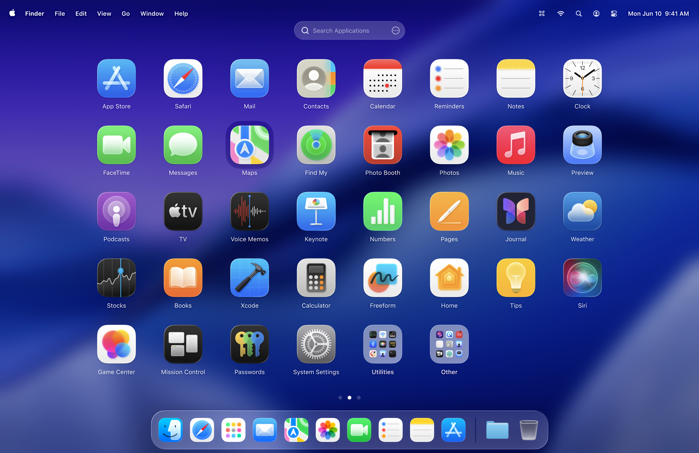

  
  <h1>LaunchOS</h1>
  

    
    
  

 
  [English](./README.md) | 简体中文
  <h3>LaunchOS - macOS 26 (Tahoe) 的最佳启动台替代品</h3>

[LaunchOS](https://launchosapp.com) 是一款专为 macOS 26（Tahoe）打造的启动台替代 APP，核心特色是与原生启动台高度相似，尤其是在手感和流畅度上，与原生启动台几乎无差异。

相比堆砌复杂设置，它更专注于提升日常使用体验的关键细节且弥补了原生启动台的不足，提供更紧凑的网格布局和高效的纵向滚动浏览，让应用查找更便捷。

